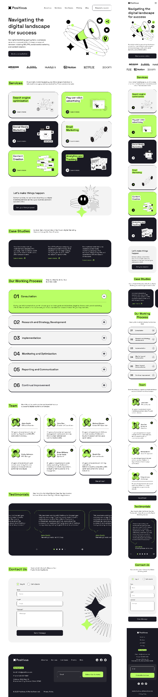

# $\color{lightgreen}\textsf{Positivus}$

$\color{limegreen}\text{Учебная работа}$

## $\color{mediumblue}\text{Описание работы }$:

Внешняя страница цифрового маркетингового агентства.

Работа на основе видеоуроков .

**Цели и задачи работы :**

❗Применение БЭМ-методологии в вёрстке.

❗Использование удобной структуры файлов проекта.

❗Широкое применение удобных для вёрстки миксинов и переменных препроцессора.

❗Практика применения утилитарных классов и рациональное переиспользование стилей.

❗Изучение способа вёрстки модального окна , без JS и сторонних библиотек.

❗ Развёртывание Vite-проекта на GitHub Pages
🎯 $\color{mediumblue}\textsf{Основная задача}$ - Вёрстка с применением сборщика проестов Vite.

---

Макет -> [**Figma**](<https://www.figma.com/design/racHPrMNd7jO0XgXQPpE7w/Positivus-Landing-Page-Design-(Community)?node-id=403-333&p=f&t=RBVSK315iW2N80p7-0>)

Вёрстка -> [**Git pages**](https://artiom-work.github.io/positivus/)

---

## $\color{mediumblue}\text{Технологии, инструменты и способы вёрстки }$:

✅ SASS
✅ БЭМ
✅ Flex
✅ Grid
✅ Адаптивная вёрстка
✅ Git
✅ Figma
✅ Vite

---

## $\color{mediumblue}\text{Новые (для меня) способы вёрстки и используемые технологии:}$

💡 Структура файлов проекта для удобной стилизации.

💡 Набор миксинов: для медиа-запросов, эффектов наведения, адаптивного размера текста, сокрытия элементов, наборы свойств для позиционирования, создание системы управления колонками grid-сетки у однотипных блоков и другие...

💡 Использование локальных и глобальных CSS и SCSS переменных.

💡 Создание общего класса для схожих по стилю grid-сеток с использованием переменных и SCSS цикла @for для генерации модификаторов селекторов класса.

💡 Мобильное бургер-меню (HTML/CSS). Реализация с помощью тега "dialog".

💡 Способ гибкого позиционирования при создании адаптивности технологией Flexbox с использованием свойства display: contents;.

💡 Способ стилизации элементов нумерованного списка без использования JS.

💡 Примеры HTML-структуры форм, а также их стилизация.
